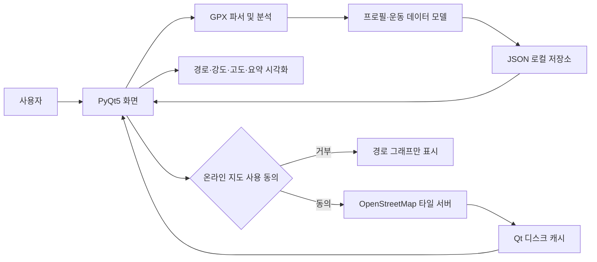

# 러닝 메이트

## 프로젝트 개요

아이폰 내 운동 기록을 가져와 러닝 데이터를 분석하고, 이동 경로와 운동 요약을 확인하는 데스크톱 애플리케이션입니다. 
데이터는 로컬에 저장하며, 지도 배경은 사용자가 위치 전송에 동의한 경우에만 불러옵니다.

### 주요 기능

- 한 개 혹은 여러 개의 GPX 파일을 운동 기록으로 저장
- 거리, 운동 시간, 속도 및 주간 운동 요약 제공
- GPS 경로와 고도 및 운동 속도에 기반한 운동 강도 색상과 함께 시각화
- 캘린더 및 리스트뷰로 기록을 탐색하고 고도 변화를 확인
- 사용자 동의 후 OpenStreetMap(OSM) 배경 지도 표시

## 서비스 흐름

1. 사용자가 프로필을 입력하고 하나 이상의 GPX 파일을 선택합니다.
2. GPX 파서가 GPS 좌표, 시각, 고도, 속도를 읽습니다.
3. 운동별 거리와 시간, 요약 통계를 계산하고 기록을 로컬 JSON 파일에 저장합니다.
4. 사용자가 날짜별 기록을 선택하면 경로·강도·고도 그래프와 운동 요약을 확인합니다.
5. 사용자가 위치 전송에 동의하면 운동 경로 지도를 요청합니다.

## 시스템 아키텍처



## 기술 스택

| 구분 | 기술 |
|---|---|
| 언어 | Python 3.10 이상 |
| 데스크톱 UI | PyQt5, Qt Designer (`gui.ui` → 실행 시 `gui.py` 생성) |
| 데이터 처리 | Python 표준 라이브러리 `xml.etree.ElementTree`, `datetime`, `zoneinfo` |
| 데이터 저장 | JSON 로컬 파일 |
| 온라인 지도 | OpenStreetMap 타일 서버, PyQt5 QtNetwork |

## 팀원 소개

| 이름 | 역할 | 소개 |
|---|---|---|
| 최재웅 | 기획/개발 | 시스템 기획 및 ui와 서비스를 개발 |

## 폴더 구조

```text
.
├── main.py                 실행 진입점 및 UI 변환
├── gui.ui                  Qt Designer 메인 화면
├── gui.py                  gui.ui에서 자동 생성되는 화면 클래스
├── requirements.txt        Python 의존성
├── workout_app/
│   ├── gpx_parser.py       GPX 파싱 및 거리 계산
│   ├── models.py          프로필·운동·GPS 포인트 모델
│   ├── storage.py         프로필·운동 JSON 저장소
│   └── ui.py              화면 동작, 그래프 및 지도 처리
├── data/                   로컬 프로필 및 운동 기록 (.gitignore 대상)
```

## 실행방법

Windows PowerShell에서 프로젝트 루트로 이동한 뒤 실행합니다.

```powershell
python -m venv .venv
.\.venv\Scripts\Activate.ps1
python -m pip install -r requirements.txt
python main.py
```

`main.py`가 실행될 때마다 `gui.ui`를 `gui.py`로 변환합니다. 변환 도구는 PyQt5에 포함되어 있어 별도 설치가 필요하지 않습니다. 첫 실행 시 프로필을 등록하고, `파일 > 데이터 불러오기`에서 GPX 파일을 추가합니다.

테스트는 다음 명령으로 실행합니다.

```powershell
python -m unittest discover -s tests -v
```

### 개인정보 및 지도 안내

프로필과 운동 기록은 `data/`에만 저장되며 Git에서 제외됩니다. GPX에는 민감한 위치와 운동 시각이 포함될 수 있으므로 실제 GPX나 개인 기록을 저장소에 추가하지 마세요. OpenStreetMap 지도를 켜면 경로 주변 위치가 타일 제공자에게 전달되며, 동의하지 않으면 경로 그래프만 표시됩니다. 타일은 현재 화면에 필요한 만큼만 요청하고 출처를 표시합니다. 자세한 내용은 [OpenStreetMap 타일 정책](https://operations.osmfoundation.org/policies/tiles/)을 따릅니다.

## 향후 계획

- GPX 포맷 및 제조사별 심박수 확장 호환성 확대
- 운동 기록 분석과 주간 요약 지표 개선
- 지도 제공 방식과 위치정보 보호 설정 개선
- 사용자 피드백을 반영한 화면 접근성 및 사용성 개선
- supabase에 사용자 데이터를 저장함으로써, 개인정보 보호 강화
